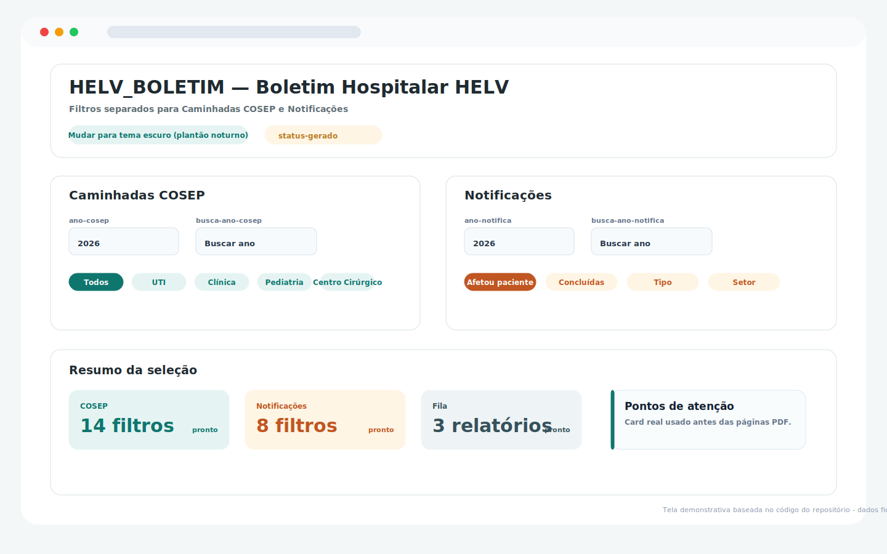
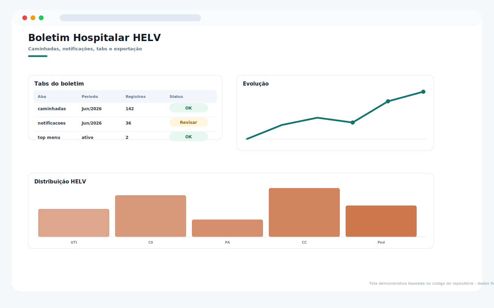
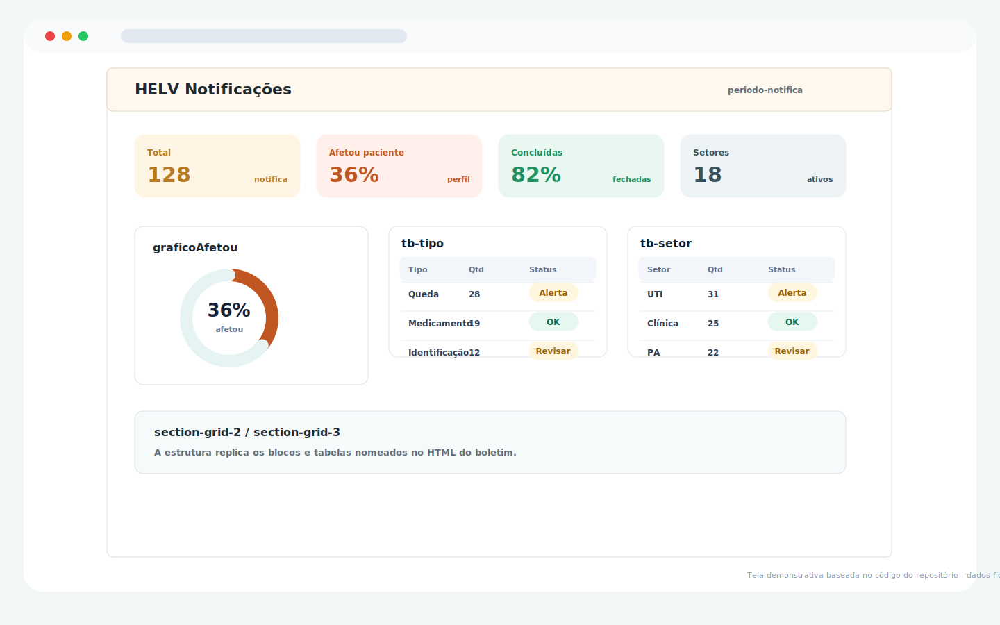

# 📋 HELV_BOLETIM — Boletim Hospitalar HELV

Sistema web para geração e gestão de boletins operacionais hospitalares, desenvolvido com Google Apps Script e Google Sheets.

---

## 📝 Descrição objetiva

O **HELV_BOLETIM** é um WebApp em **Google Apps Script + Google Sheets + HTML/CSS/JS** criado para centralizar e exibir informações de boletim hospitalar de forma estruturada, permitindo acompanhamento em tempo real dos dados operacionais do hospital.

---

## 🚀 Funcionalidades

- Visualização consolidada de dados do boletim hospitalar
- Interface web responsiva e intuitiva
- Integração direta com planilha Google Sheets como fonte de dados
- Atualização automática dos indicadores via Apps Script

---

## 🛠️ Tecnologias

- Google Apps Script (backend)
- Google Sheets (banco de dados)
- HTML / CSS / JavaScript (frontend WebApp)

---

## ⚙️ Como publicar

1. Crie uma planilha Google com a estrutura de dados do boletim.
2. Em `Extensões > Apps Script`, cole os arquivos `Code.gs` e `index.html`.
3. Implante em `Implantar > Nova implantação` como **Aplicativo da Web**:
   - Executar como: **Eu**
   - Quem pode acessar: **Sua organização**
4. Copie o URL e compartilhe com a equipe.

## Guia visual do sistema

> Telas demonstrativas baseadas nos componentes, textos, cores e fluxos encontrados no código deste repositório. Os dados exibidos são fictícios e não representam pacientes, profissionais ou instituições reais.

### HELV - filtros e resumo

### HELV - páginas e indicadores

### HELV - notificações

